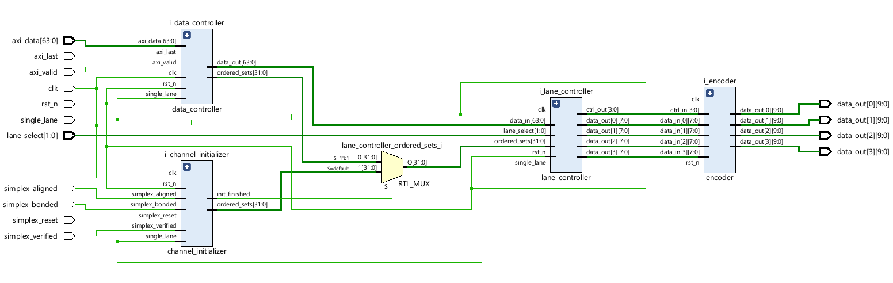

# Aurora 8b/10b Simplex Transmitter

Implementation of the Aurora 8b/10b Simplex Transmitter

## Parameters

Name | Value
--- | ---
maximum links | 4
duplex | no
input data protocol | axi stream (valid, last, data)
output data protocol | Aurora 8b/10b
modes | single lane / multi lane
single lane selection | 0 / 1 / 2 / 3
single lane data clock | system clock / 8
multi lane data clock | system clock / 2

## Documentation

You may find Aurora 8b/10b protocol documentation [here](doc/aurora_8b10b_protocol_spec_sp002.pdf)

## Schematic

## Authors

- Cisło Krzysztof
- Działowy Jakub
